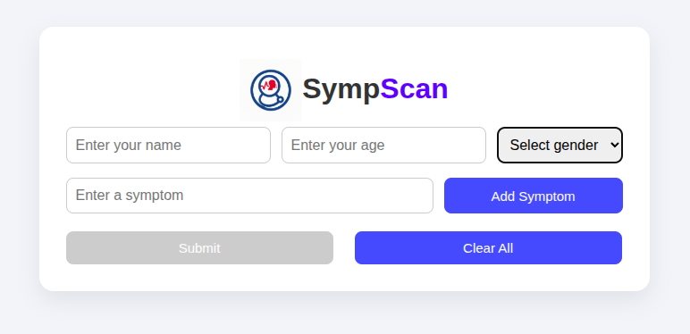
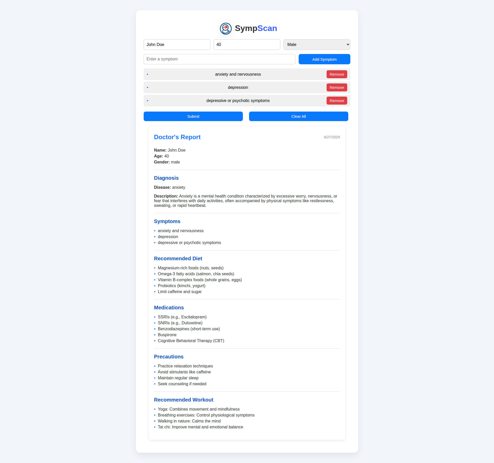

# 🤖 SympScan – AI-Based Symptom Analysis System

**SympScan** is a full-stack AI-powered web application that predicts diseases based on user-input symptoms and recommends personalized treatments, precautions, diets, and workouts. This system combines a machine learning backend with an interactive frontend.

---

## 🧭 Project Overview

- **Purpose**: Predict diseases from symptoms and provide health-related recommendations.
- **Type**: Full-stack AI web application.
- **Frontend**: React.js (interactive and user-friendly interface).
- **Backend**: Flask (Python-based REST API for ML predictions).
- **ML Model**: Random Forest Classifier trained on 96,000+ medical records.

---

## 🛠️ Technology Stack

| Layer       | Technology                  |
|------------|------------------------------|
| Frontend   | React.js, HTML5, CSS3        |
| Backend    | Flask (Python), Node.js (React setup) |
| ML Tools   | Scikit-learn, Pandas         |
| Storage    | CSV-based structured files   |

---

## 🤖 Machine Learning Model

- **Type**: Supervised Learning – Multi-class Classification  
- **Algorithm**: Random Forest Classifier  
- **Features**: 200+ binary-encoded symptoms (e.g., `fever = 1`, `headache = 0`)  
- **Output**: ~100 possible disease classes  
- **Model File**: `model.pkl` used for real-time predictions via Flask API  
- **Dataset Source**: [Kaggle](https://www.kaggle.com/datasets/behzadhassan/sympscan-symptomps-to-disease) (refined for clinical reliability)

---

## 📊 Dataset Details – *SympScan Dataset*

A medically inspired dataset curated for disease classification, healthcare ML tasks, and decision support applications.

### 📑 Main Features

- **Instances**: ~96,000 patient records  
- **Input**: 200+ symptoms (binary format)  
- **Output**: ~100 disease categories  
- **Includes**: Recommendations for medication, diet, precautions, workouts

### 📁 Dataset Files

| File Name                          | Description                                      |
|-----------------------------------|--------------------------------------------------|
| `Diseases_and_Symptoms_dataset.csv` | Main dataset: symptoms ➝ disease mapping        |
| `descriptions.csv`                | Disease summaries and medical descriptions       |
| `medications.csv`                 | Recommended medicines for each condition         |
| `precautions.csv`                 | Preventive measures per disease                  |
| `workouts.csv`                    | Suggested physical activity routines             |
| `diets.csv`                       | Disease-specific diet and nutrition plans        |

> 📌 Dataset and Jupyter notebook are available on [Kaggle](https://www.kaggle.com/datasets/behzadhassan/sympscan-symptomps-to-disease).

---

## 🚀 Local Setup Instructions

1. **Clone the repo**
   ```bash
   git clone https://github.com/BehzadHassan/SympScan.git
   cd SympScan
   
2. **Start Backend (Flask)**
   ```bash
   cd backend
   pip install -r requirements.txt
   python app.py


3. **Start Frontend (React)**
   ```bash
   cd frontend
   npm install
   npm start

---

## 💡 Key Use Cases

- 🩺 Disease prediction using symptoms  
- 🧠 Feature importance and model explainability  
- 📊 Healthcare automation and diagnosis tools  
- 🤖 Chatbot and virtual health assistant backends  
- 🧬 Personalized health and wellness recommender systems  

---

## 📌 Project Status

- ✅ Functional and tested locally  
- 🚧 Future: Deploy to cloud (e.g., Heroku, Render, or Vercel)  
- 📁 Dataset publicly available  

---

### 📸 Demo – SympScan in Action

Below are sample views from the SympScan application showcasing its core functionality:

#### 🏠 Home Page – Symptom Input
Users can select multiple symptoms from a dynamic checklist to get real-time disease predictions.



#### 🧾 Result Page – Prediction & Recommendations
After submitting symptoms, the system predicts the most probable disease and provides relevant treatments, precautions, diets, and workout suggestions.



---

## 👨‍💻 Contributors

[Behzad Hassan](https://github.com/BehzadHassan) – Developer & ML Engineer

---

## 📜 License

This project is for academic use only and is not intended for clinical deployment.  
Licensing terms can be updated if publicly released.

---
